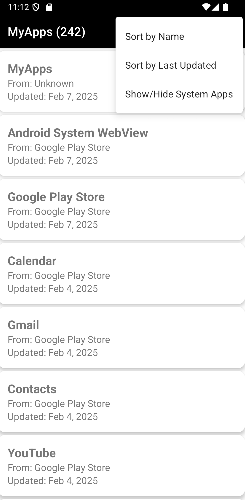

<div align="center">

[](https://github.com/ail1020/MyApps/stargazers)
[](https://github.com/ail1020/MyApps/blob/master/LICENSE)
[](https://github.com/ail1020/MyApps/releases/)
[](https://github.com/ail1020/MyApps/releases)

</div>

Just a simple app that displays installed apps. Was made to help me identify when an app hasn't been updated in a long time.

Features include:
- list user installed apps by default
- show/hide system apps
- display where app was installed from
- sort by app name
- sort by updated date

## Installation

[](https://github.com/ail1020/MyApps/releases)

[](https://apps.obtainium.imranr.dev/redirect?r=obtainium://app/%7B%22id%22%3A%22info.ails.myapps%22%2C%22url%22%3A%22https%3A%2F%2Fgithub.com%2Fail1020%2FMyApps%22%2C%22author%22%3A%22ail1020%22%2C%22name%22%3A%22MyApps%22%2C%22preferredApkIndex%22%3A0%2C%22additionalSettings%22%3A%22%7B%5C%22includePrereleases%5C%22%3Afalse%2C%5C%22fallbackToOlderReleases%5C%22%3Atrue%2C%5C%22filterReleaseTitlesByRegEx%5C%22%3A%5C%22%5C%22%2C%5C%22filterReleaseNotesByRegEx%5C%22%3A%5C%22%5C%22%2C%5C%22verifyLatestTag%5C%22%3Afalse%2C%5C%22dontSortReleasesList%5C%22%3Afalse%2C%5C%22useLatestAssetDateAsReleaseDate%5C%22%3Afalse%2C%5C%22trackOnly%5C%22%3Afalse%2C%5C%22versionExtractionRegEx%5C%22%3A%5C%22github%2F(.%2B)%5C%22%2C%5C%22matchGroupToUse%5C%22%3A%5C%221%5C%22%2C%5C%22versionDetection%5C%22%3Afalse%2C%5C%22releaseDateAsVersion%5C%22%3Afalse%2C%5C%22useVersionCodeAsOSVersion%5C%22%3Afalse%2C%5C%22apkFilterRegEx%5C%22%3A%5C%22%5C%22%2C%5C%22invertAPKFilter%5C%22%3Afalse%2C%5C%22autoApkFilterByArch%5C%22%3Atrue%2C%5C%22appName%5C%22%3A%5C%22%5C%22%2C%5C%22shizukuPretendToBeGooglePlay%5C%22%3Afalse%2C%5C%22exemptFromBackgroundUpdates%5C%22%3Afalse%2C%5C%22skipUpdateNotifications%5C%22%3Afalse%2C%5C%22about%5C%22%3A%5C%22%5C%22%7D%22%2C%22overrideSource%22%3Anull%7D)

#### AppVerifier hashes 
**MyApps**: 
```
info.ails.myapps
F2:2F:16:EC:FA:A0:EA:5E:C4:CA:C2:6B:0C:92:C0:E8:DE:94:80:94:26:18:9A:2C:A8:5E:1E:BE:45:70:67:DB
```

## Screenshots

|  |  |

## Having issues, suggestions and feedback?

You can,
- [Create an issue here](https://github.com/ail1020/MyApps/issues)

Feel free to [submit pull requests](https://github.com/ail1020/MyApps/pulls).
